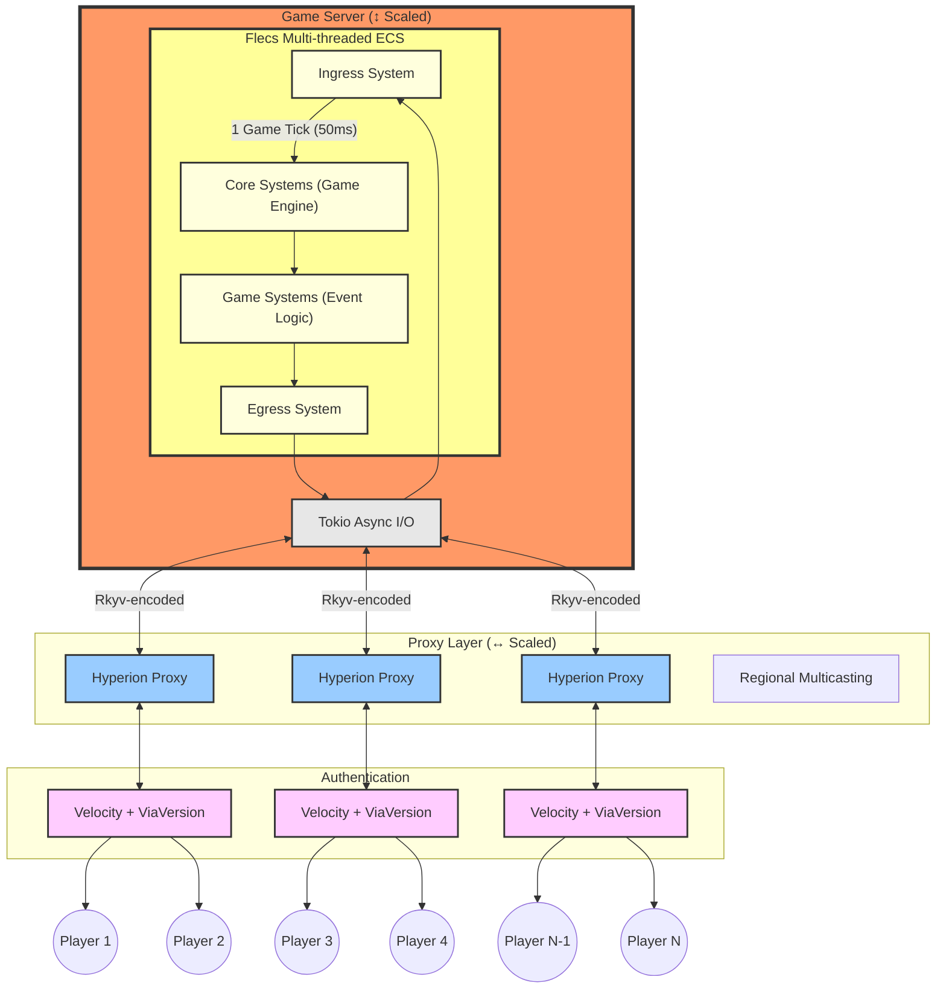
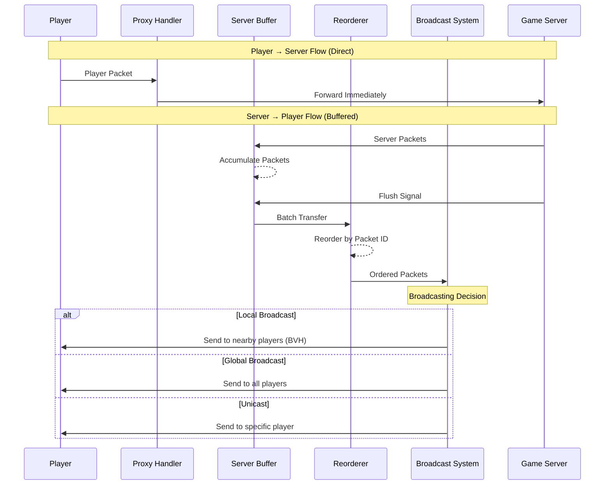

# Hyperion

[](https://discord.gg/PBfnDtj5Wb)
[](https://discord.gg/GxtzEJfSQe)

Thank you for your hard work [@TestingPlant](https://github.com/TestingPlant), [@james-j-obrien](https://github.com/james-j-obrien), [@Ruben2424](https://github.com/Ruben2424), [@CuzImClicks](https://github.com/CuzImClicks), [@Indra-db](https://github.com/Indra-db), [@SanderMertens](https://github.com/SanderMertens).

Hyperion is a **Minecraft game engine** that aims to enable a 10k player PvP battle to break the Guinness World
Record ([8825 by
EVE Online](https://www.guinnessworldrecords.com/world-records/105603-largest-videogame-pvp-battle)). The
architecture is ECS-driven using [Flecs Rust](https://github.com/Indra-db/Flecs-Rust).

https://github.com/user-attachments/assets/64a4a8c7-f375-4821-a1c7-0efc69c1ae0b

# Event

The upcoming 10k-player PvP event draws inspiration from the class progression systems and [tag mode](https://diepio.fandom.com/wiki/Tag) from [diep.io](https://diep.io/). The gameplay mechanics also draw influence from Hypixel Pit's combat systems. Players will gain levels (XP) from mining ore and killing other players.

We're partnering with [TheMisterEpic](https://www.youtube.com/channel/UCJiFgnnYpwlnadzTzhMnX_Q) to run an initial proof-of-concept event with around 2k players. Following its success, we'll host the full-scale 10,000-player PvP battle alongside numerous YouTubers and streamers.


# Benchmarks

| Players | Tick Time (ms) | Core Usage (%) | Total CPU Utilization (%) |
|---------|----------------|----------------|---------------------------|
| 1       | 0.24           | 4.3            | 0.31                      |
| 10      | 0.30           | 10.3           | 0.74                      |
| 100     | 0.46           | 10.7           | 0.76                      |
| 1000    | 0.40           | 15.3           | 1.09                      |
| 5000    | 1.42           | 35.6           | 2.54                      |


*= with UNIX sockets, not TCP sockets. Once I get better tests, I will fill in core usage and CPU utilization.

**Test Environment:**

- Machine: 2023 MacBook Pro Max 16" (14-cores)
- Chunk Render Distance: 32 (4225 total)
- Commit hash `faac9117` run with `just release`
- Bot Launch Command: `just bots {number}`

**Note on Performance:**
The system's computational costs are primarily fixed due to thread synchronization overhead. Each game tick contains
several $O(1)$ synchronization points, meaning these operations maintain constant time complexity regardless of player
count. This architecture explains why performance remains relatively stable even as player count increases
significantly - the thread synchronization overhead dominates the performance profile rather than player-specific
computations.

The bulk of player-specific processing occurs in our proxy layer, which handles tasks like regional multicasting and can
be horizontally scaled to maintain performance as player count grows.


# Architecture

## Overview


## Proxy




# Running

## Debug mode

```bash
docker compose up --build
```

## Release mode

```bash
docker compose -f docker-compose.release.yml up --build
```

# Features

**Language:** Rust  
**Goal:** Game engine for massive events  
**Structure:** flecs ECS

**Platform Details:**
- Version: Minecraft 1.20.1
- Proxy Support: Velocity
- Proximity Voice: Simple Voice Chat
- Max estimated player count: ~176,056

## Feature Status

| Feature                      | Status        | Notes                               |
|------------------------------|---------------|-------------------------------------|
| **Core Game Mechanics**      |
| Block Breaking/Placing       | ✅ Implemented | Including physics simulation        |
| Entity Collisions            | ✅ Implemented | Both entity-entity and block-entity |
| Lighting Engine              | ✅ Implemented | Dynamic lighting updates            |
| World Borders                | ✅ Implemented | Configurable boundaries             |
| Block Edit API               | ✅ Implemented | WorldEdit-like functionality        |
| PvP Combat                   | ✅ Implemented | Custom combat mechanics             |
| Inventory System             | ✅ Implemented | Full item management                |
| Raycasting                   | 🚧 Planned    | Required for ranged combat/arrows   |
| **Player Experience**        |
| Particle Effects             | ✅ Implemented | Full particle support               |
| Chat System                  | ✅ Implemented | Global and proximity chat           |
| Commands                     | ✅ Implemented | Custom command framework            |
| Proximity Voice              | ✅ Implemented | Using Simple Voice Chat             |
| **Technical Infrastructure** |
| Multi-threading              | ✅ Implemented | Vertical scaling                    |
| Proxy Layer                  | ✅ Implemented | Horizontal scaling with Velocity    |
| Performance Tracing          | ✅ Implemented | Using Tracy profiler                |
| Basic Anti-Cheat             | ✅ Implemented | Core anti-cheat functionality       |
| Moderator Tools             | 🚧 Planned    | Admin controls and monitoring       |

Legend:
- ✅ Implemented
- 🚧 Planned
- ❌ Not Planned

**Note:** This feature list represents core functionality. Hyperion is designed to be modular meaning you can implement
your own mechanics and replace the core mechanics with your own.