# Hyperion

[](https://discord.gg/PBfnDtj5Wb)
[](https://discord.gg/GxtzEJfSQe)
[](https://andrewgazelka.github.io/hyperion/)
[](https://github.com/andrewgazelka/hyperion/issues)
[](https://github.com/andrewgazelka/hyperion/commits)

Thank you for your hard work[^1] [@CuzImClicks](https://github.com/CuzImClicks), [@Indra-db](https://github.com/Indra-db), [@james-j-obrien](https://github.com/james-j-obrien), [@Ruben2424](https://github.com/Ruben2424), [@SanderMertens](https://github.com/SanderMertens), [@Tebarem](https://github.com/Tebarem), and [@TestingPlant](https://github.com/TestingPlant).

Hyperion is a **Minecraft game engine** that aims to enable a 10k player PvP battle to break the Guinness World
Record ([8825 by
EVE Online](https://www.guinnessworldrecords.com/world-records/105603-largest-videogame-pvp-battle)). The
architecture is ECS-driven using [Flecs Rust](https://github.com/Indra-db/Flecs-Rust).

https://github.com/user-attachments/assets/64a4a8c7-f375-4821-a1c7-0efc69c1ae0b

## Event

The upcoming 10k-player PvP event draws inspiration from the class progression systems and [tag mode](https://diepio.fandom.com/wiki/Tag) from [diep.io](https://diep.io/). The gameplay mechanics also draw influence from Hypixel Pit's combat systems. Players will gain levels (XP) from mining ore and killing other players.

We're partnering with [TheMisterEpic](https://www.youtube.com/channel/UCJiFgnnYpwlnadzTzhMnX_Q) to run an initial proof-of-concept event with around 2k players. Following its success, we'll host the full-scale 10,000-player PvP battle alongside numerous YouTubers and streamers.


## Benchmarks

| Players | Tick Time (ms) | Core Usage (%) | Total CPU Utilization (%) |
|---------|----------------|----------------|---------------------------|
| 1       | 0.24           | 4.3            | 0.31                      |
| 10      | 0.30           | 10.3           | 0.74                      |
| 100     | 0.46           | 10.7           | 0.76                      |
| 1000    | 0.40           | 15.3           | 1.09                      |
| 5000    | 1.42           | 35.6           | 2.54                      |


*= with UNIX sockets, not TCP sockets. Once I get better tests, I will fill in core usage and CPU utilization.

**Test Environment:**

- Machine: 2023 MacBook Pro Max 16" (14-cores)
- Chunk Render Distance: 32 (4225 total)
- Commit hash `faac9117` run with `just release`
- Bot Launch Command: `just bots {number}`

**Note on Performance:**
The system's computational costs are primarily fixed due to thread synchronization overhead. Each game tick contains
several $O(1)$ synchronization points, meaning these operations maintain constant time complexity regardless of player
count. This architecture explains why performance remains relatively stable even as player count increases
significantly - the thread synchronization overhead dominates the performance profile rather than player-specific
computations.

The bulk of player-specific processing occurs in our proxy layer, which handles tasks like regional multicasting and can
be horizontally scaled to maintain performance as player count grows.


## Architecture

### Overview

```mermaid
flowchart TB
    subgraph GameServer["Game Server (↕️ Scaled)"]
        direction TB
        subgraph FlecsMT["Flecs Multi-threaded ECS"]
            direction LR
            IngressSys["Ingress System"] --> |"1 Game Tick (50ms)"| CoreSys["Core Systems (Game Engine)"] --> GameSys["Game Systems (Event Logic)"] --> EgressSys["Egress System"]
        end
        
        TokioIO["Tokio Async I/O"]
        TokioIO --> IngressSys
        EgressSys --> TokioIO
    end
    
    subgraph ProxyLayer["Proxy Layer (↔️ Scaled)"]
        direction TB
        Proxy1["Hyperion Proxy"]
        Proxy2["Hyperion Proxy"]
        ProxyN["Hyperion Proxy"]
        
        MulticastLogic["Regional Multicasting"]
    end
    
    subgraph AuthLayer["Authentication"]
        Velocity1["Velocity + ViaVersion"]
        Velocity2["Velocity + ViaVersion"]
        VelocityN["Velocity + ViaVersion"]
    end
    
    Player1_1((Player 1))
    Player1_2((Player 2))
    Player2_1((Player 3))
    Player2_2((Player 4))
    PlayerN_1((Player N-1))
    PlayerN_2((Player N))
    
    TokioIO <--> |"Rkyv-encoded"| Proxy1
    TokioIO <--> |"Rkyv-encoded"| Proxy2
    TokioIO <--> |"Rkyv-encoded"| ProxyN
    
    Proxy1 <--> Velocity1
    Proxy2 <--> Velocity2
    ProxyN <--> VelocityN
    
    Velocity1 --> Player1_1
    Velocity1 --> Player1_2
    Velocity2 --> Player2_1
    Velocity2 --> Player2_2
    VelocityN --> PlayerN_1
    VelocityN --> PlayerN_2
    
    classDef server fill:#f96,stroke:#333,stroke-width:4px
    classDef proxy fill:#9cf,stroke:#333,stroke-width:2px
    classDef auth fill:#fcf,stroke:#333,stroke-width:2px
    classDef ecs fill:#ff9,stroke:#333,stroke-width:3px
    classDef system fill:#ffd,stroke:#333,stroke-width:2px
    classDef async fill:#e7e7e7,stroke:#333,stroke-width:2px
    
    class GameServer server
    class FlecsMT ecs
    class IngressSys,CoreSys,GameSys,EgressSys system
    class Proxy1,Proxy2,ProxyN proxy
    class Velocity1,Velocity2,VelocityN auth
    class TokioIO async
```


### Proxy


## Running

### Debug mode

```bash
docker compose up --build
```

### Release mode

```bash
docker compose -f docker-compose.release.yml up --build
```

## Features

**Language:** Rust  
**Goal:** Game engine for massive events  
**Structure:** flecs ECS

**Platform Details:**
- Version: Minecraft 1.20.1
- Proxy Support: Velocity
- Proximity Voice: Simple Voice Chat
- Max estimated player count: ~176,056

## Feature Status

| Feature                      | Status                                                                                                                                                                                        | Notes                                                                                                        |
|------------------------------|-----------------------------------------------------------------------------------------------------------------------------------------------------------------------------------------------|--------------------------------------------------------------------------------------------------------------|
| **Technical Infrastructure** |                                                                                                                                                                                               |                                                                                                              |
| 🧵 Multi-threading           | ✅ Implemented                                                                                                                                                                                 | Vertical scaling                                                                                             |
| 🔄 Proxy Layer               | ✅ Implemented                                                                                                                                                                                 | Horizontal scaling                                                                                           |
| 📊 Performance Tracing       | ✅ Implemented                                                                                                                                                                                 | Using Tracy profiler                                                                                         |
| 🛡️ Basic Anti-Cheat         | ✅ Implemented                                                                                                                                                                                 | Core anti-cheat functionality                                                                                |
| 🔧 Moderator Tools           | 🚧 WIP [#425](https://github.com/andrewgazelka/hyperion/issues/425), [@Kumpelinus](https://github.com/Kumpelinus)                                                                             | Admin controls and monitoring                                                                                |
| 🔌 Plugin API                | ✅ Implemented                                                                                                                                                                                 | Extensible plugin system; see [`events/tag`](https://github.com/andrewgazelka/hyperion/tree/main/events/tag) |
| **Core Game Mechanics**      |                                                                                                                                                                                               |                                                                                                              |
| 🧱 Block Breaking/Placing    | ✅ Implemented                                                                                                                                                                                 | Including physics simulation                                                                                 |
| 💫 Entity Collisions         | ✅ Implemented                                                                                                                                                                                 | Both entity-entity and block-entity                                                                          |
| 💡 Lighting Engine           | ✅ Implemented                                                                                                                                                                                 | Dynamic lighting updates                                                                                     |
| 🌐 World Borders             | ✅ Implemented                                                                                                                                                                                 | Configurable boundaries                                                                                      |
| 🛠️ Block Edit API           | ✅ Implemented                                                                                                                                                                                 | WorldEdit-like functionality                                                                                 |
| ⚔️ PvP Combat                | ✅ Implemented                                                                                                                                                                                 | Custom combat mechanics                                                                                      |
| 🎒 Inventory System          | ✅ Implemented                                                                                                                                                                                 | Full item management                                                                                         |
| 🎯 Raycasting                | 🚧 WIP [#580](https://github.com/andrewgazelka/hyperion/issues/580) [#584](https://github.com/andrewgazelka/hyperion/issues/584) [#598](https://github.com/andrewgazelka/hyperion/issues/598) | Required for ranged combat/arrows                                                                            |
| **Player Experience**        |                                                                                                                                                                                               |                                                                                                              |
| ✨ Particle Effects           | ✅ Implemented                                                                                                                                                                                 | Full particle support                                                                                        |
| 💬 Chat System               | ✅ Implemented                                                                                                                                                                                 | Global and proximity chat                                                                                    |
| ⌨️ Commands                  | ✅ Implemented                                                                                                                                                                                 | Custom command framework                                                                                     |
| 🎤 Proximity Voice           | ✅ Implemented                                                                                                                                                                                 | Using Simple Voice Chat                                                                                      |

Legend:
- ✅ Implemented
- 🚧 WIP/Planned
- ❌ Not Planned

**Note:** This feature list represents core functionality. Hyperion is designed to be modular meaning you can implement
your own mechanics and replace the core mechanics with your own.

## Star History

[](https://star-history.com/#andrewgazelka/hyperion&Date)


[^1]: alphabetically ordered
