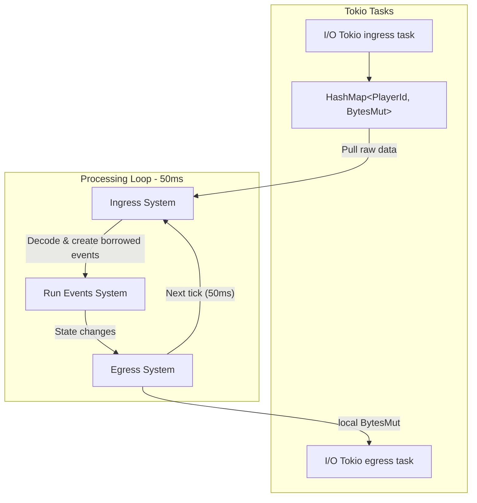

# Game Server

## Overview



## Egress

### Buffers

The systems are running in multiple threads with entities partitioned across them.
Suppose we have 8 threads[^1].

This means that the egress system will send thread-local 8 [
`bytes::BytesMut`](https://docs.rs/bytes/latest/bytes/struct.BytesMut.html)[^2]
to the tokio egress task at the end of every tick.

The contents in the buffers are [rkyv-encoded](https://github.com/rkyv/rkyv) packets
specified [here](https://github.com/andrewgazelka/hyperion/blob/main/crates/hyperion-proto/src/server_to_proxy.rs):

```rust
#[derive(Archive, Deserialize, Serialize, Clone, PartialEq)]
pub struct BroadcastLocal<'a> {
    pub center: ChunkPosition,
    pub exclude: u64,
    pub order: u32,

    #[rkyv(with = InlineAsBox)]
    pub data: &'a [u8],
}

#[derive(Archive, Deserialize, Serialize, Clone, PartialEq)]
pub struct Unicast<'a> {
    pub stream: u64,
    pub order: u32,

    #[rkyv(with = InlineAsBox)]
    pub data: &'a [u8],
}
```

### Ordering

Many of the rkyv-encoded packets have a specific `order` field. The order is calculated as

```rust
system_id << 16 | order_id
```

where `system_id` is the strictly increasing ID of the system that is sending the packet and `order_id` is a
thread-local
counter that is incremented on each packet write.

This allows the proxy to reorder the 8 thread-local buffers into one buffer that has the same logical ordering as the
order of the systems and the order of the packets within each system.


## Ingress

### Tokio Async Task
The tokio async ingress task creates a data structure
defined [here](https://github.com/andrewgazelka/hyperion/blob/0c1a0386548d71485c442cf5e9c9ebb2ed58142e/crates/hyperion/src/net/proxy.rs#L16-L23).

```rust
#[derive(Default)]
pub struct ReceiveStateInner {
    /// All players who have recently connected to the server.
    pub player_connect: Vec<u64>,
    /// All players who have recently disconnected from the server.
    pub player_disconnect: Vec<u64>,
    /// A map of stream ids to the corresponding [`BytesMut`] buffers. This represents data from the client to the server.
    pub packets: HashMap<u64, BytesMut>,
}
```

### Decoding System

Then, when it is time to run the ingress system, we lock the mutex for `ReceiveStateInner` and process the data,
decoding all the packets until we get

```rust
#[derive(Copy, Clone)]
pub struct BorrowedPacketFrame<'a> {
    pub id: i32,
    pub body: &'a [u8],
}
```

where the `'a` lifetime is the duration of the entire tick (the `BytesMut` are deallocated at the end of the tick).

### Event Generation

For each entity's packet, we have a switch statement over what we should do for each
packet [here](https://github.com/andrewgazelka/hyperion/blob/bb30c0680ef3822aa9a30d84e289c8db39e38150/crates/hyperion/src/simulation/handlers.rs#L609-L641).

Note: all packet-switch logic is done in parallel (based on the number of threads) and which entity is partitioned
on that thread.

```rust
pub fn packet_switch(
    raw: BorrowedPacketFrame<'_>,
    query: &mut PacketSwitchQuery<'_>,
) -> anyhow::Result<()> {
    let packet_id = raw.id;
    let data = raw.body;

    // ideally we wouldn't have to do this. The lifetime is the same as the entire tick.
    // as the data is bump-allocated and reset occurs at the end of the tick
    let data: &'static [u8] = unsafe { core::mem::transmute(data) };

    match packet_id {
        play::ChatMessageC2s::ID => chat_message(data, query)?,
        play::ClickSlotC2s::ID => click_slot(data, query)?,
        play::ClientCommandC2s::ID => client_command(data, query)?,
        play::CommandExecutionC2s::ID => chat_command(data, query)?,
        play::CreativeInventoryActionC2s::ID => creative_inventory_action(data, query)?,
        play::CustomPayloadC2s::ID => custom_payload(data, query)?,
        play::FullC2s::ID => full(query, data)?,
        play::HandSwingC2s::ID => hand_swing(data, query)?,
        play::LookAndOnGroundC2s::ID => look_and_on_ground(data, query)?,
        play::PlayerActionC2s::ID => player_action(data, query)?,
        play::PlayerInteractBlockC2s::ID => player_interact_block(data, query)?,
        play::PlayerInteractEntityC2s::ID => player_interact_entity(data, query)?,
        play::PlayerInteractItemC2s::ID => player_interact_item(data, query)?,
        play::PositionAndOnGroundC2s::ID => position_and_on_ground(query, data)?,
        play::RequestCommandCompletionsC2s::ID => request_command_completions(data, query)?,
        play::UpdateSelectedSlotC2s::ID => update_selected_slot(data, query)?,
        _ => trace!("unknown packet id: 0x{:02X}", packet_id),
    }

    Ok(())
}
```

[^1]: the actual number is assigned at compile-time for maximum performance and is usually equal to the number of cores
on the machine.

[^2]: `bytes::BytesMut` re-uses the underlying buffer and tracks allocations and deallocations so allocations each tick
are not needed.