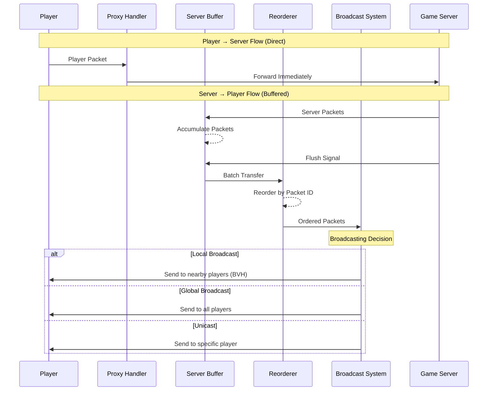

# Proxy

## Overview

The proxy is special because it is aware of certain parts of the game server's internal state: mainly the
chunk locations of each player. This allows to do regional broadcasting very efficiently from the game server.
Taking compute and I/O off of the game server allows for a massive performance boost as the game server can only
vertically scale while the proxy can horizontally scale.

Given $n$ players and an average $m$ players in a given render distance the runtime & memory of the game server for each
operation is:

| Operation Type           | Vanilla Minecraft                              | Proxy-Based Approach            | Description                                                                       |
|--------------------------|------------------------------------------------|---------------------------------|-----------------------------------------------------------------------------------|
| Global Broadcast         | $O(n)$ packets                                 | $O(1)$ `BroadcastGlobal` packet | One `BroadcastGlobal` with optional `exclude` vs sending to each player           |
| Local/Regional Broadcast | $O(m)$ packets where $m$ is local cluster size | $O(1)$ `BroadcastLocal` packet  | One `BroadcastLocal` with `center` vs computing and sending to each nearby player |
| Unicast                  | $O(1)$ direct send                             | $O(1)$ `Unicast` packet         | Similar complexity but proxy adds `order` for sequencing                          |

Key efficiency gains:

1. **Global Broadcast**:
    - Vanilla: Must send $n$ separate packets
    - Proxy: Single `BroadcastGlobal` with implicit fan-out

2. **Regional Broadcast**:
    - Vanilla: Must compute intersections and send $O(m)$ packets
    - Proxy: Single `BroadcastLocal` lets proxy handle finding nearby players and broadcasting

This is a massive optimization for MMO-scale player counts where sending all the player movement positions would
be $O(nm)$ for all players whereas when using a proxy it is only $O(n)$.

The proxy also reorders all packets such that they are in the same order as the game server even though the
game server has multiple thread-local buffers.

