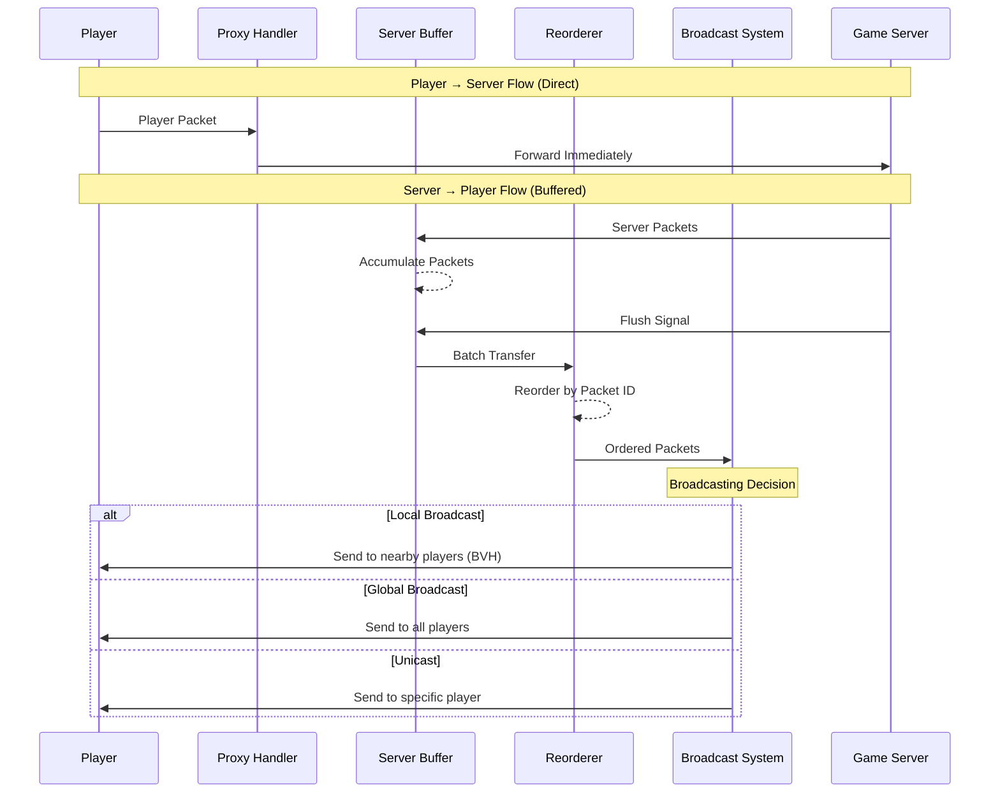

# Proxy

## Overview

The proxy is special because it is aware of certain parts of the game server's internal state: mainly the
chunk locations of each player. This allows to do regional broadcasting very efficiently from the game server.
Taking compute and I/O off of the game server allows for a massive performance boost as the game server can only
vertically scale while the proxy can horizontally scale.

| Operation Type           | Vanilla Minecraft                                  | Proxy-Based Approach                                                                                            |
|--------------------------|----------------------------------------------------|-----------------------------------------------------------------------------------------------------------------|
| Global Broadcast         | Server sends one packet to every player            | Server sends one `BroadcastGlobal` packet to the proxy. The proxy will send a packet to each player.            |
| Local/Regional Broadcast | Server sends one packet to each player in a region | Server sends one `BroadcastLocal` packet to the proxy. The proxy will send a packet to each player in a region. |
| Unicast                  | Server sends one packet to a specific player       | Server sends one `Unicast` packet to the proxy. The proxy will send a packet to a specific player.              |

Using a proxy is a massive optimization for large player counts. For example, to update player positions in Vanilla
Minecraft, the server would need to send every player's position to everyone in the same area as that player. In the
worst-case scenario where every player is in the same area, meaning that every player needs to know the position of
every other player, the server would need to send $n^2$ packets where $n$ is the number of players. This would lead
to a large amount of CPU, memory, and network usage from one server. However, with a proxy-based system, the server
would only need to send $n$ packets to each proxy. Although there would still be $n^2$ total packets sent from each
proxy, this work is spread out across multiple proxies instead of being done on one server.

The proxy also reorders all packets such that they are in the same order as the game server even though the
game server has multiple thread-local buffers.

