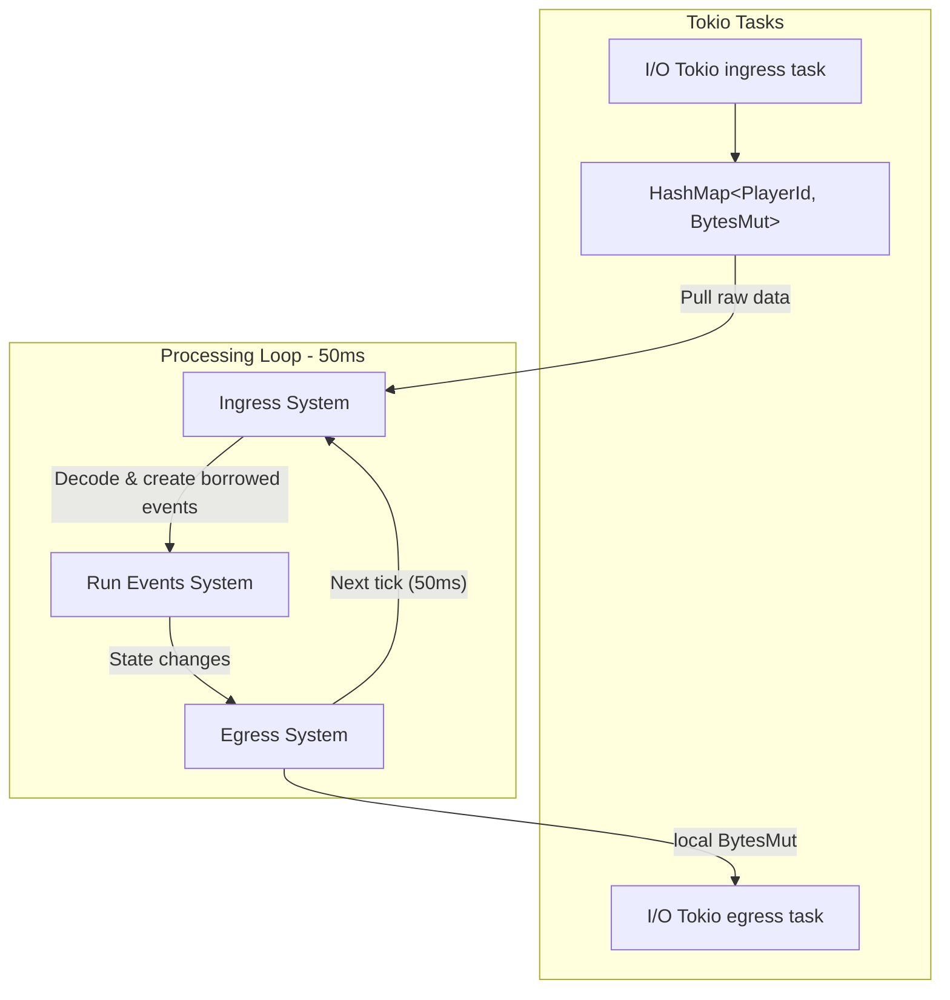

# Architecture

## Game Server Overview



## I/O

The systems are running in multiple threads with entities partitioned across them.
Suppose we have 8 threads (the number is assigned at compile-time for maximum performance).

This means that the egress system will send thread-local 8 [
`bytes::BytesMut`](https://docs.rs/bytes/latest/bytes/struct.BytesMut.html)
to the tokio egress task at the end of every tick.

<GithubSnippet target="https://github.com/andrewgazelka/hyperion/blob/0c1a0386548d71485c442cf5e9c9ebb2ed58142e/crates/hyperion-proto/src/server_to_proxy.rs#L27-L44"></GithubSnippet>

## Ordering

## Ingress System

```rust
#[derive(Copy, Clone)]
pub struct BorrowedPacketFrame<'a> {
    pub id: i32,
    pub body: &'a [u8],
}
```


