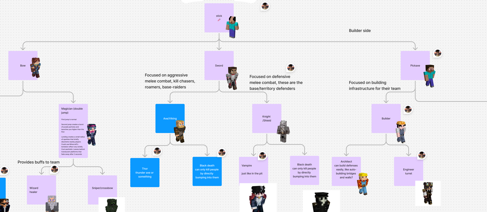

# 10,000 Player PvP Event

Our pilot event is a 10,000 player PvP battle to break the Guinness World Record for the largest PvP battle ever.

We're partnering with [TheMisterEpic](https://www.youtube.com/channel/UCJiFgnnYpwlnadzTzhMnX_Q) to run an initial
proof-of-concept event with around 2k players. Following its success, we'll host the full-scale 10,000 player PvP battle
alongside numerous YouTubers and streamers.

## Inspiration

- [Diep.io Tag](https://diepio.fandom.com/wiki/Tag)
- Hypixel *The Pit*

## Teams

When players join the game, they are assigned to a team.

- Red team
- Blue team
- Green team
- Yellow team

Teams are designated by their boot color.

Their goal is to gather resources and kill all other players on opposing teams to increase their XP points.

When a player is killed

- the killed player respawns with $1/3$ of their XP points
- the killer receives $1/2$ of the XP points
    - this is to make sure that killing players is not inflationary; $1/3 + 1/2 < 1$.

## Classes

{data-zoomable}

There is an upgrade tree. Everyone starts out as the stick class, which is the most basic class.

